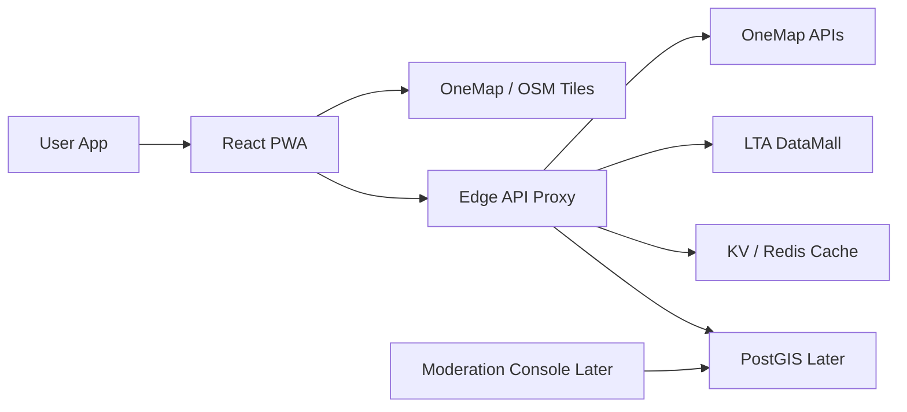
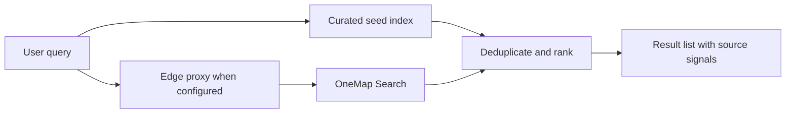

# Architecture

## System Shape

## Current Implementation

- `src/domain`: typed product entities.
- `src/data`: curated seed records, source registry and layer definitions.
- `src/services`: search and provider integration boundaries.
- `src/state`: app interaction state.
- `src/components`: map surface and UI panels.
- `api/onemap-worker.ts`: Cloudflare Worker style proxy for OneMap search plus LTA parking and bus feeds.

## Production Direction

1. Keep all paid or credentialed providers behind an API gateway.
2. Cache read-heavy geospatial responses with short TTLs.
3. Store user reports and POI corrections in PostGIS.
4. Add moderation, confidence scoring and source history before public crowdsourcing.
5. Use native mobile shells only after the PWA interaction model proves retention.

## Search Pipeline

The UI must never wait on live providers before showing useful local results. Live providers enrich the list and raise confidence, but the fallback must remain fast and usable.

## Free-First Provider Choices

- Singapore base map: OneMap tiles with required attribution.
- Regional base map: OpenStreetMap during MVP.
- Search seed: curated local POIs, then OneMap proxy for Singapore.
- Transport: LTA DataMall behind the same edge proxy.
- Hosting: Vercel/Netlify plus Cloudflare Workers.
