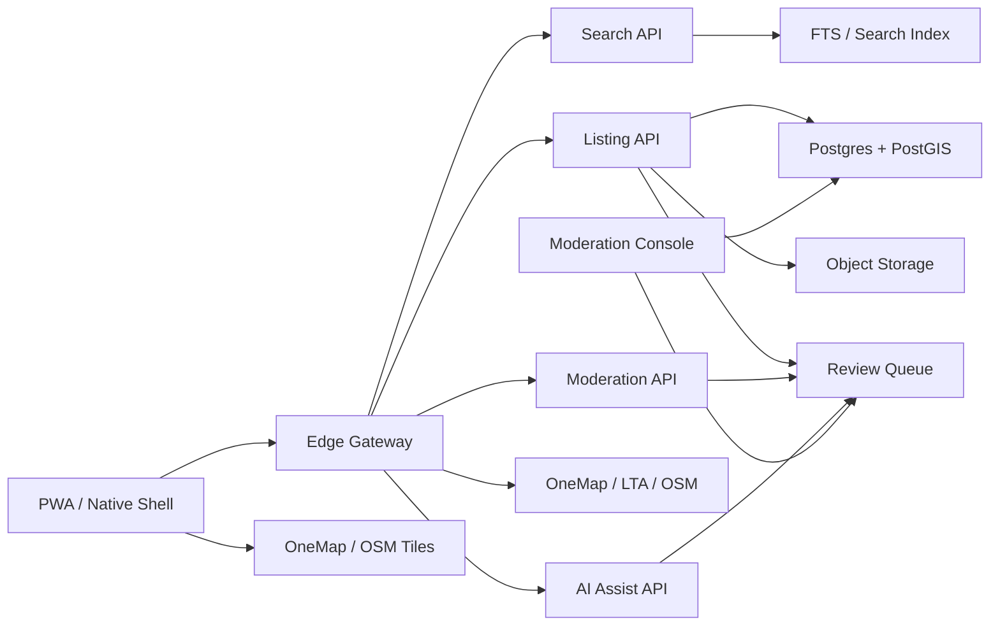

# Local Marketplace Technical Architecture

## Architecture Goal

Keep the map fast while adding marketplace depth behind it. Marketplace features should be modular, cacheable and safe to disable without breaking map search or navigation.

The architecture must be operable by a tiny AI-native team. Prefer managed services, serverless APIs, strong admin tooling, audit logs and automated checks over custom infrastructure that needs daily maintenance.

## System Shape

## Free-First Stack

Use the current stack until retention is proven:

- Frontend: React, TypeScript, Vite PWA.
- Edge: Cloudflare Worker.
- Database: Supabase Postgres with PostGIS on free tier, or Cloudflare D1 for simpler records.
- Storage: Supabase Storage or Cloudflare R2 for listing images.
- Search phase 1: Postgres full-text search plus trigram search.
- Search phase 2: Meilisearch, Typesense or managed search when marketplace volume grows.
- Queue: Cloudflare Queues or Supabase table-backed queue.
- AI: server-side calls only, never from client.

## Core Domains

### Listing

Fields:

- `id`
- `category`: food, attraction, event, rental, second_hand, service, supply, demand
- `title`
- `description`
- `price`
- `currency`
- `location_point`
- `place_id`
- `country`
- `area`
- `seller_id`
- `status`: draft, pending_review, active, rejected, paused, expired, removed
- `visibility`: free, featured, sponsored
- `expires_at`
- `created_at`
- `updated_at`

### User

Fields:

- `id`
- `display_name`
- `trust_level`
- `phone_verified`
- `email_verified`
- `posting_limits`
- `strike_count`

Do not expose phone/email directly unless the user chooses to show them.

### Merchant

Fields:

- `id`
- `owner_user_id`
- `business_name`
- `verification_status`
- `category`
- `place_id`
- `uen_or_registration_reference` later
- `subscription_status`

### Moderation Case

Fields:

- `id`
- `subject_type`: listing, user, message, image
- `subject_id`
- `risk_score`
- `reason_codes`
- `status`
- `reviewer_id`
- `decision`
- `audit_log`

### Payment Order

Fields:

- `id`
- `user_id`
- `item_type`: featured_listing, urgent_review, subscription, lead_pack
- `platform`: web, ios, android
- `provider`: stripe, paynow, app_store, google_play
- `status`
- `amount`
- `currency`
- `entitlement_id`

## Listing Lifecycle

1. User creates draft.
2. Client uploads images to temporary storage.
3. Server normalizes location, category, title and price.
4. AI pre-checks text and images for quality, spam and prohibited content.
5. Risk score decides auto-approve, manual review or reject.
6. Active listing becomes searchable and map-visible.
7. Users can report, save, route, contact or share.
8. Expiry and renewal rules keep listings fresh.

## Search Experience

Search must blend:

- Official places from OneMap.
- Curated places.
- Marketplace listings.
- Merchant offers.
- Community reports.

Ranking inputs:

- Query match.
- Distance from map center or route.
- Category intent from active mode.
- Listing freshness.
- Trust score.
- Paid visibility, capped and labelled.
- Safety filters.

Paid ranking rule: paid posts can enter the candidate pool earlier, but must not hide better organic results. Keep sponsored density low.

## AI Features

Start with low-risk assistive AI:

- Listing title cleanup.
- Bilingual English/Chinese/Malay description rewrite.
- Category suggestion.
- Duplicate detection.
- Spam and scam risk scoring.
- Image quality checks.
- Search intent expansion.
- Tourist itinerary suggestions from saved places and public transport context.

Avoid at launch:

- Fully automated rejection without appeal.
- Financial, legal, medical or tenancy advice.
- AI-generated fake reviews.
- Autonomous messages to buyers or sellers.

## Performance Budget

Target:

- App shell interactive under 2 seconds on normal 4G.
- First map paint before marketplace feed.
- Search input response under 100 ms locally.
- Official/provider search results streamed or merged after local results.
- Listing images lazy-loaded below the fold.
- Marketplace tab code-split from map shell.

Techniques:

- Cache provider search and listing queries at edge.
- Store map viewport feeds by geohash tile.
- Keep home screen marketplace cards small and paginated.
- Use image thumbnails and blur-free placeholders.
- Avoid loading chat, payments or admin bundles in map view.

## Privacy And Compliance

Design for Singapore PDPA from day one:

- Collect only needed personal data.
- State posting, messaging, AI moderation and recommendation purposes clearly.
- Provide account deletion and listing deletion paths.
- Keep retention windows for expired listings and moderation logs.
- Protect phone/email with masked contact flows.
- Use server-side AI with logs minimized and secrets protected.

## Admin Console

Must exist before public marketplace launch:

- Review queue.
- Listing detail and image viewer.
- User history and trust score.
- Report handling.
- Decision audit log.
- Category policy editor.
- Search/recommendation override.
- Merchant verification workflow.

## AI-Native Ops Controls

The system should assume that AI agents will draft code, support replies, moderation suggestions, translations and analytics summaries. That requires product-level controls:

- Separate production secrets from agent prompts and client bundles.
- Require human approval for account bans, high-risk rental removals, refunds, paid campaign disputes and data deletion.
- Store AI moderation reason codes and reviewer decisions.
- Add internal dashboards for provider health, listing review backlog, user reports, paid listing density and complaint rate.
- Keep all risky automation behind feature flags.

## Step-By-Step Build Plan

### Step 1: Read-Only Discovery

- Add marketplace tab as read-only curated data.
- Categories: food, attractions, rentals sample, second-hand sample.
- No posting, no payment.

### Step 2: Account And Saved Intent

- Add login.
- Save offers/listings.
- Contact intent event without chat.
- Track route starts from listing.

### Step 3: Controlled Posting

- Add posting form.
- First categories: food offer, event, rental lead, second-hand.
- All posts pending review.
- Add report listing.

### Step 4: Paid Information Fee Pilot

- Web/PWA paid listing first.
- Native app store billing later for digital boosts/subscriptions.
- Paid listing label and capped density.

### Step 5: Messaging And Merchant Tools

- Masked chat.
- Merchant dashboard.
- Analytics and renewal.

### Step 6: AI Scale

- AI moderation assistant.
- AI listing rewrite.
- AI recommendations by mode, route, time and weather.
- Human review remains available for appeals.
