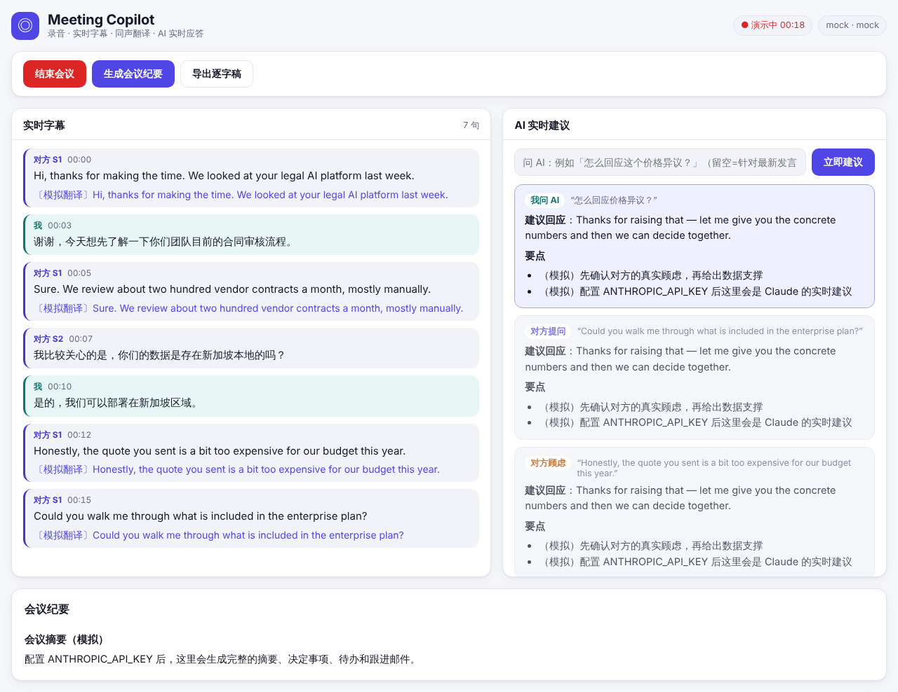

# Meeting Copilot

AI 会议助手：粘贴 **Google Meet / Microsoft Teams / Zoom / 腾讯会议（VooV）** 链接，在浏览器中入会后即可：

- 🎙 **在线录音**：会议音频 + 你的麦克风混合录制，会后本地下载（WebM/Opus）
- 📝 **实时字幕**：区分"我"和"对方"，对方多人时自动区分说话人（S1、S2…）
- 🌐 **实时翻译**：每句话说完即翻译成你选择的语言（中英混说也可以）
- 💡 **AI 实时应答**：对方提问或提出异议时，自动给出可以直接说出口的回应 + 要点 + 风险提示；也可以随时手动问 AI
- 🌏 **双语回复**：建议回应用**对方的语言**（可直接念），下方附**你的语言**翻译，卡片标明「用 English 回复」
- 📎 **参考文件**：上传报价单、产品手册等 PDF / TXT / Markdown / CSV，AI 建议会引用并注明出处
- 🏷 **说话人命名**：点击 S1/S2 改成真实姓名，AI 建议和纪要都会使用
- 📋 **会后纪要**：一键生成摘要、决定事项、待办和跟进邮件草稿，并可导出逐字稿
- 🗂 **会议历史**：会后自动保存在本机浏览器（不上传服务器），可全文搜索、查看、导出、删除
- 📊 **实时指标**：建议延迟、翻译延迟、识别音频时长、token、预估费用、建议好评率；静音时不发送音频以节省识别费用
- 🖥 **桌面版**：直接采集系统声音（配合 Zoom / Teams / 腾讯会议桌面客户端），置顶提词器对屏幕共享不可见，全局快捷键，密钥由系统钥匙串加密
- 🪟 **画中画提词器**（浏览器版）：置顶小窗口，看会议时也能看到建议
- 📶 **断网续会**：网络中断时本地缓存音频，重连后续上同一场会议并补发，不丢内容
- 📅 **日历与会前简报**：订阅日历（ICS）自动列出即将开始的会议并提醒；AI 根据日历、历史会议和未完成待办生成会前简报和预计问答
- ✅ **会议结果**：自动提取决定事项、待办（负责人 + 截止日期）和跟进邮件；待办可勾选、导出 CSV、加入日历，邮件一键发给参会人
- 📣 **会后推送**：一键或自动推送到飞书、钉钉、企业微信、Slack、Teams 群，或带签名的通用 Webhook
- 🤖 **会议机器人**：派机器人自动加入 Zoom / Google Meet / Teams，本机无需共享任何东西，手机上也能看实时字幕和建议
- 🙋 **「这是我」**：机器人或线下麦克风听到所有人时，标记哪个说话人是你，你的发言不会触发建议
- 🔗 **只读实时共享**：生成链接让同事实时查看字幕、翻译和纪要（可选是否共享 AI 建议），随时停止
- 📈 **会议分析**：发言占比、发言次数、最长连续发言、提问次数、语速，会中实时显示你的发言占比
- ⚡ **首条建议更快**：会议开始即预热 AI 缓存（简报和参考文件），安静一段时间后的建议依然秒出
- 📱 **可安装到手机**（PWA）：配合会议机器人和共享链接，用手机看实时字幕和建议
- 🧹 **隐私控制**：历史记录保留期限、全部导出、一键全部删除



完整的架构设计、技术选型、合规与路线图见 **[docs/PLAN.md](docs/PLAN.md)**。

## 10 分钟会前上手（本机运行，用于 Google Meet 等网页会议）

1. 安装 [Node.js 22+](https://nodejs.org/) 和 Chrome（或 Edge）。
2. 获取代码并安装依赖：

   ```bash
   git clone -b claude/ai-meeting-tool-plan-e77i4z https://github.com/cndingbo2030/lokalane.git
   cd lokalane/meeting-copilot
   npm install
   ```

   如果下载 Electron 很慢或失败，可跳过桌面版组件：macOS / Linux 用 `ELECTRON_SKIP_BINARY_DOWNLOAD=1 npm install`；Windows PowerShell 先执行 `$env:ELECTRON_SKIP_BINARY_DOWNLOAD=1`，再执行 `npm install`。
3. 复制 `.env.example` 为 `.env`，填入 `ANTHROPIC_API_KEY` 和 `SONIOX_API_KEY`（只有 Deepgram 时填 `DEEPGRAM_API_KEY` 并把 `STT_PROVIDER` 改为 `deepgram`）。
4. 启动：`npm run dev`，用 Chrome 打开 http://localhost:5180 。
5. **2 分钟自检**：打开 http://localhost:8790/health ，应看到 `"stt":"soniox"`、`"llm":"anthropic"`。然后在首页选「线下会议（仅麦克风）」→ 勾选同意 → 开始，中英文各说一句：出现字幕说明语音识别正常，出现翻译说明 Claude 正常；在右侧输入框问 AI 一个问题，出现建议卡片即全部正常。结束这场测试会议即可。
6. **正式开会**：先在 Chrome 的一个标签页里用网页版加入 Google Meet；回到本工具，粘贴会议链接，选「线上会议（共享会议标签页 + 麦克风）」，选择会议语言和翻译语言，填写会前简报（可上传报价单等资料），勾选同意后点「开始」。在弹窗中选 **Google Meet 所在的标签页**，并打开 **「同时分享标签页音频」**。请戴耳机。可点「画中画提词器」，让建议浮在会议画面上方。
7. 会后：点「生成会议纪要」，得到纪要、决定事项、待办和跟进邮件；可导出逐字稿、下载录音。

常见问题：页面顶部出现「语音识别出错」或「翻译失败」，通常是密钥填写有误，或账号没有对应模型的权限（可在 `.env` 中把 `COPILOT_MODEL` / `TRANSLATE_MODEL` / `SUMMARY_MODEL` 改为 `claude-sonnet-5-5`，或把 `SONIOX_MODEL` 改为 `stt-rt-v4` 后重启）。

## 快速开始

需要 Node.js 22+ 和 Chrome / Edge 浏览器。

```bash
cd meeting-copilot
npm install
cp .env.example .env      # 填入密钥（不填也能跑演示）
npm run dev               # 同时启动服务端 (8790) 和前端 (5180)
```

打开 http://localhost:5180 ，先点 **「试用演示会议」**：无需任何密钥即可看到字幕、翻译、AI 建议和纪要的完整流程（无密钥时使用模拟数据）。

### 配置密钥（`.env`，只放在服务端）

| 变量 | 作用 |
|------|------|
| `SONIOX_API_KEY` | 实时语音识别（默认，中英混说效果好） |
| `DEEPGRAM_API_KEY` | 备选语音识别（`STT_PROVIDER=deepgram`；Nova-3 的多语言混说模式不含中文，中文会议请固定单一语言或用 Soniox） |
| `ANTHROPIC_API_KEY` | Claude：实时翻译、实时建议、会议纪要 |
| `COPILOT_MODEL` / `TRANSLATE_MODEL` / `SUMMARY_MODEL` | 各角色使用的模型，默认 `claude-opus-5-5` |
| `ACCESS_TOKEN` | 可选；设置后需用 `http://host/?token=...` 访问（同时保护 WebSocket 和所有接口；只读共享链接用自己的一次性令牌） |
| `ALLOWED_ORIGINS` | 可选；允许连接 WebSocket 的来源，逗号分隔 |
| `ALLOW_PRIVATE_NETWORK` | 可选；`true` 时日历订阅和 Webhook 可以访问内网地址（自建 n8n、内网日历）。面向公网的服务器请保持关闭 |
| `ATTENDEE_API_KEY` / `ATTENDEE_BASE_URL` | 可选；开启会议机器人模式（[Attendee](https://attendee.dev) 托管版或自部署） |
| `PUBLIC_URL` | 机器人模式必填：本服务的公网 https 地址，机器人通过 `wss://…/ws/bot` 回传音频 |
| `TRUST_PROXY` | 在你控制的反向代理之后设为 `true`，限流按真实客户端地址计算（docker-compose 已设置） |
| `MAX_SESSIONS` | 同时进行的会议数上限，默认 50 |
| `DOMAIN` | Docker 部署时的域名，Caddy 自动为其申请 HTTPS 证书 |

没有 STT 密钥时，服务端用能量 VAD 模拟识别（只显示"检测到语音 x 秒"），可用来确认音频采集链路是否正常。

## 开一场真实会议

1. 粘贴会议链接（或整段邀请文字），工具会识别平台和会议号；Zoom 链接会自动改写成网页入会链接。
2. 点 **「在新标签页打开会议」**，用网页版加入会议（Teams 选"在此浏览器上继续"，腾讯会议选"网页入会"）。
3. 选择会议语言和翻译目标语言，填写会前简报（你的角色、目标、报价/产品资料/术语）——简报越具体，AI 的建议越可靠。
4. 勾选"已告知与会者并取得同意"，点 **「开始」**，在浏览器弹窗中选择**会议所在的标签页**并勾选**「同时分享标签页音频」**。
5. 建议佩戴耳机，避免对方声音被麦克风重复采集。
6. 会议结束后：生成会议纪要、导出逐字稿、下载录音。

线下会议可选择「仅麦克风」模式。

参考文件会上传到 Claude Files API（无密钥时只在服务端内存中保留文件信息），在界面上点「移除」即删除。

## 会前：日历与简报

1. 首页「即将开始的会议」→ 粘贴日历订阅链接（Google 日历：设置 → 集成日历 →「iCal 格式的私密地址」；Outlook：设置 → 日历 → 共享日历 → 发布日历）。
2. 会议开始前 2 分钟会弹出提醒（可开启系统通知）；点「准备」自动填入会议链接并关联日历事件，点「加入并准备」同时打开会议。
3. 点「✨ AI 生成会前简报」：AI 结合日历描述、参会人、同系列历史会议的纪要和未完成待办、参考文件，生成目标、议程、预计问题与建议回答。可直接修改；重新生成只替换 AI 部分。

## 会后：结果与推送

生成会议纪要后，「会议结果」面板会列出**决定事项、待办和跟进邮件草稿**：

- 待办可勾选完成（保存在本机历史），可导出 CSV 或「加入日历」（有截止日期的待办成为全天日程）；
- 跟进邮件可复制，或「用邮件发送」直接写给日历中的参会人；
- 在「会后推送」中添加飞书 / 钉钉 / 企业微信 / Slack / Teams 群机器人或通用 Webhook，添加时会自动发送一条测试消息；勾选「自动推送」后，会议结果生成即推送。

通用 Webhook 会以 JSON POST 完整结果（`event: "meeting.outcomes"`，含纪要、决定、待办、跟进邮件）。填写密钥时附带签名头，接收方这样校验：

```js
const expected = 'sha256=' + crypto.createHmac('sha256', secret).update(`${req.headers['x-meeting-copilot-timestamp']}.${rawBody}`).digest('hex')
// 与 x-meeting-copilot-signature 做常量时间比较，并拒绝时间戳超过 5 分钟的请求
```

## 会议机器人（自动入会）

配置 `ATTENDEE_API_KEY` 和 `PUBLIC_URL` 后，采集方式中会出现「会议机器人（自动入会）」：粘贴 Zoom / Google Meet / Teams 链接 → 填写机器人名称 → 开始。机器人入会后会在聊天中发送录音告知；若停在等候室或 Zoom 需要录制许可，界面会提示主持人操作。结束会议时机器人离会，可下载它录制的音频。

机器人听到的是整场会议（包括你自己）：在字幕中点你的说话人标签 →「这是我」，你的发言就不会再触发 AI 建议。本地测试可用 `cloudflared tunnel --url http://localhost:8790` 之类的隧道获得公网 https 地址。腾讯会议暂不支持机器人，请用标签页或桌面版系统声音。

## 实时共享

会议中点「共享」→「生成只读链接」，把链接发给同事：对方无需登录即可实时查看字幕、翻译和会议纪要，可选是否同时共享 AI 建议（跟进邮件草稿不会共享）。中途打开链接也能看到之前的全部内容；停止共享或会议结束后链接立即失效。

## 桌面版

```bash
npm run desktop           # 构建并启动桌面应用（开发测试）
npm run desktop:package   # 打包：macOS dmg/zip、Windows 安装包、Linux AppImage（未签名测试包，输出到 release/）
```

- 启动后在首页「桌面版设置」里填写 API 密钥（用系统钥匙串加密保存在本机），选择「系统声音」模式即可配合任意会议软件使用。
- 系统声音采集：Windows 支持；macOS 取决于系统版本，拿不到声音时会提示改用标签页模式或虚拟声卡（如 BlackHole）。
- 快捷键：`Ctrl/⌘ + Shift + Space` 立即建议，`Ctrl/⌘ + Shift + O` 显示/隐藏提词器。
- 默认对屏幕共享隐藏本应用窗口（可在设置中关闭）。
- 请在目标系统上打包（macOS 包在 macOS 上打，Windows 包在 Windows 上打）。

## 评测

```bash
npm run eval:copilot -- --mock        # 离线检查评测脚本本身（不调用 API）
npm run eval:copilot                  # 真实模型 + Claude 评审（会产生 API 费用）
npm run eval:stt -- --languages zh,en # 真实 STT 跑 evals/stt/*.wav（见 evals/stt/README.md）
```

用例在 `evals/copilot-cases.json`，报告写到 `evals/reports/`（不提交到仓库）。

## 部署

### Docker（推荐，自动 HTTPS）

```bash
cp .env.example .env    # 填写 DOMAIN、ACCESS_TOKEN 和各项 API 密钥
docker compose up -d --build
```

- 先把域名（`DOMAIN`）解析到服务器并开放 80 / 443 端口；Caddy 会自动申请和续期 HTTPS 证书，WebSocket 直接透传。
- 会议机器人的回传地址自动设为 `https://DOMAIN`，配置好 `ATTENDEE_API_KEY` 即可使用机器人模式。
- **面向公网时务必设置 `ACCESS_TOKEN`**，并用 `https://DOMAIN/?token=…` 访问；否则任何人都能调用你的 AI 和语音识别额度。
- 镜像以非 root 用户运行，带健康检查；收到停止信号时会结束进行中的会议（机器人离会）后退出。

### 直接运行

```bash
npm run build     # 类型检查 + 构建前端（dist/）和服务端（dist-server/）
npm start         # 生产模式：同一端口提供页面、/health 和 /ws
```

浏览器采集麦克风和标签页要求 **HTTPS**（localhost 除外），请放在 HTTPS 反向代理之后；此时设置 `TRUST_PROXY=true`，限流才能识别真实客户端地址。

### 生产防护（内置）

- 按客户端限流：AI 简报、会后推送、日历抓取、文件上传、新开会议，超限返回 429 和 `Retry-After`。
- `MAX_SESSIONS`（默认 50）限制同时进行的会议数，保护识别和模型费用。
- 页面带安全响应头：不发送 Referer（防止地址中的令牌泄露给外部网站）、只允许本站脚本和连接、禁止被嵌入其他网站。

## 开发

```bash
npm run lint
npm run test       # 单元测试 + 会话集成测试（不需要任何密钥）
npm run build      # 类型检查 + 前端构建
```

| 目录 | 内容 |
|------|------|
| `src/shared/` | 前后端共享：线路协议、会议链接解析、PCM 重采样、VAD 与音频时钟、语言工具 |
| `src/server/` | WebSocket + HTTP 服务、会话编排、STT 适配器、Claude 客户端、提示词、触发器、指标、参考文件、日历、会后推送、会议机器人、只读共享、防 SSRF 请求、限流 |
| `src/web/` | React 界面、音频采集引擎、连接管理、状态、本地会议历史、日历、会议结果与推送、只读观看页 |
| `src/desktop/` | Electron 主进程（内置服务、系统声音、提词器窗口、快捷键、加密设置）与 preload |
| `src/eval/` | 评测：混合错误率、WAV 解码、STT / Copilot 评测脚本 |
| `public/pcm-worklet.js` | AudioWorklet 采集处理器 |
